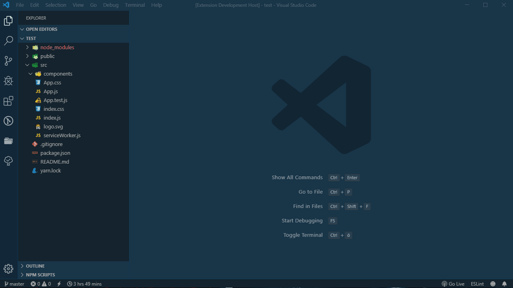

# VS-Code Folder Templates

### What is this and why

VS-Code Folder Templates is an extension that creates your folders/files as specified in custom templates.

Why? Because creating the same directories over and over again is annoying to do manually.

### Features

- Create Templates for folder structures and files and then let the extension do the rest.
- Spend your time actually programming and not creating files.



## Templating

To create your templates you have two options.

1. Create templates on your File System
2. Go into your `settings.json` from VSCode and create templates [manually](#template-format). (Open the command palette and select "Open Settings (JSON)" to easily access your settings.json)

### Interpolation

The value `<FTName>` (or `[FTName]`) will always be interpolated into the component name you are asked for when creating the structure.
Adding a transformer with this pattern `<FTName | transformer>` (or `<FTName % transformer>`) will give you the ability to transform your componentname wherever needed.
The currently supported transformers are:

- `lowercase`
- `uppercase`
- `camelcase`
- `capitalcase`
- `constantcase`
- `dotcase`
- `headercase`
- `nocase`
- `paramcase`
- `pascalcase`
- `pathcase`
- `sentencecase`
- `snakecase`
- `singular`
- `plural`
- `lowercasefirstchar`
- `capitalize`
- `kebabcase`

It is possible to specify a set of custom Variables which will be interpolated as well. You will be asked to enter a value for every custom variable defined. They can be transformed the same way as the default `<FTName>`

### UPDATE: Now you can use absolute path parts in your template.

To use corresponding part, specify <Part0> - <PartN>, depending on how long path is picked. For example for path "P:\projects\contributing\vscode-folder-templates":
P - <Path0>, projects - <Path1>, contributing - <Path2>. Path parts can be transformed.
Examples

| Input            | Transformer                                | Result           | Description                                                                                                     |
| ---------------- | -------------------------------------------| ---------------- | ----------------------------------------------------------------------------------------------------------------|
| LOWERCASE        | \<FTName \| lowercase\>                    | lowercase        ||
| uppercase        | \<FTName \| uppercase\>                    | UPPERCASE        ||
| My-new-component | \<FTName \| camelcase\>                    | myNewComponent   | (First letter is lowercased. Every letter behind a special character will be capitalized)                       |
| test string      | \<FTName \| capitalcase\>                  | Test String      ||
| test string      | \<FTName \| constantcase\>                 | TEST_STRING      ||
| test string      | \<FTName \| dotcase\>                      | test.string      ||
| test string      | \<FTName \| headercase\>                   | Test-String      ||
| test string      | \<FTName \| nocase\>                       | test string      ||
| test string      | \<FTName \| paramcase\>                    | test-string      ||
| my-new-component | \<FTName \| pascalcase\>                   | MyNewComponent   | (First letter and every letter behind a special character will be capitalized)                                  |
| test string      | \<FTName \| pathcase\>                     | test/string      ||
| test string      | \<FTName \| sentencecase\>                 | Test string      ||
| test string      | \<FTName \| snakecase\>                    | test_string      ||
| boxes            | \<FTName \| singular\>                     | box              ||
| box              | \<FTName \| plural\>                       | boxes            ||
| wooden box       | \<FTName \| plural?snakecase?uppercase\>   | WOODEN_BOXES     | it is possible to combine transformations with the "?" or "&" operator, these will be performed from left to right.    |
| wooden box       | \[FTName \% plural&snakecase&uppercase\]   | WOODEN_BOXES     | "&" operator example of row above    |
| MyNewComponent   | \<FTName \| lowercasefirstchar\>           | myNewComponent   ||
| myNewComponent   | \<FTName \| capitalize\>                   | MyNewComponent   | just like capitalcase|
| myNewComponent   | \<FTName \| kebabcase\>                    | my-new-component | just like paramcase|
| aaa              | \<FTName \| replacefirst('a', 'b')\>       | baa              | IMPORTANT: Due to filesystem limitations (thanks Windows) only single quotes (`'`) will work to annotate the string in the replacefirst function.|
| aaa              | \<FTName \| replacelast('a', 'b')\>        | aab              | IMPORTANT: Due to filesystem limitations (thanks Windows) only single quotes (`'`) will work to annotate the string in the replacelast function.|
| aaa              | \<FTName \| replace('a', 'b')\>            | bbb              | IMPORTANT: Due to filesystem limitations (thanks Windows) only single quotes (`'`) will work to annotate the string in the replace function.|

### Date values

As of v3.12.0 it is possible to add dates to a file name or its content. However it will only be possible to add the current time in your local time zone or UTC. The way to achieve this is by using the placeholder `\[DATE_NOW(FORMATSTRING)\]` for local timezone or `\[DATE_NOW_UTC(FORMATSTRING)\]` for UTC time.

As an example `[DATE_NOW('yyyy-mm-dd')]` will result in `2024-03-04`. Please take a look at this [https://date-fns.org/v2.30.0/docs/format](https://date-fns.org/v2.30.0/docs/format) documentation to see all the available formatting patterns.

### Thanks to the change-case and pluralize libraries, for the transformations

- [https://github.com/blakeembrey/change-case](https://github.com/blakeembrey/change-case)
- [https://www.npmjs.com/package/pluralize](https://www.npmjs.com/package/pluralize)

## Creating templates on the File System

One option is to create a `.fttemplates` folder in your project root and save all templates you want to access in this project there. This path can be changed via the `folderTemplates.templateFolderPath` setting in your vscode settings.

To use global templates over multiple projects use the `Set Custom Global Folder Templates Directory` command to choose a folder which functions as a global `.fttemplates` directory.

**DEPRECATED**: You can also use the global template folder that exists in the directory of this extension.

Create a folder with files and folders inside your template directory and use placeholders wherever you need them. That's it. You created your template. It works out of the box but if you need some special settings for a template you can create a `.ftsettings.json` file inside your template folder.

See more in the [examples](https://github.com/Huuums/vscode-folder-templates/tree/master/examples)

### folderTemplates.templateFolderPath

This setting is used to deviate from the default `.fttemplates` folder path at the root of your project folder. If this setting is set then Folder Templates will look for your templates at the specified path (relative to your project root)

- Default `.fttemplates`

### Available .ftsettings.json Properties

| Key                    | Type                                  | Default                               | Description                                                                                                                                                                        |
|------------------------|---------------------------------------|---------------------------------------|------------------------------------------------------------------------------------------------------------------------------------------------------------------------------------|
| name                   | string                                | Name of parent folder                 | Name of the folder Template                                                                                                                                                        |
| customVariables        | string[] `variableName=>defaultvalue` | -                                     | Custom variables to be interpolated upon folder creation                                                                                                                           |
| omitParentDirectory    | boolean                               | false                                 | If set to true FT will create all files directly inside the current folder instead of creating a new folder and all the files inside of it.                                        |
| omitFTName             | boolean                               | false                                 | If set to true FT will not ask for a component name. (Can only be set to true if omitParentDirectory is true as well)                                                              |
| overwriteExistingFiles | "never" \| "always" \| "prompt"       | "never"                               | If set to always all existing files will be overwritten. If set to prompt user will be asked which files shall be overwritten upon foldercreation.                                 |
| openFilesWhenDone      | string[]                              | -                                     | List of files to open when the Folder Template is created. (Supports use of variables, see examples)                                                                               |
| setExecutablePermission| boolean                                 | false                                 | If set to true automatically adds executable permission to created file. Only works if file in the template is also executable.|
| absolutePath           | boolean                               | false                                 | If set to true all files will be created relative to the project root. Not relative to the folder you clicked on. (Can only be set to true if omitParentDirectory is true as well) |
| templateNotation       | {start: string[], end: string[]}      | `{start: ["<","["], end: [">", "]"]}` | If you would like to customize how to annotate strings that should be interpolated use this option                                                                                  |
| ignoreFiles            | string[]                                | []                       | This option takes an array of globs to define which files should not be created by the extension  |

## Creating your Template in VS Code settings.json {#template-format}

There are two key parts to creating your FT Templates. [Folder Structures](#foldertemplatestructures) and [File Templates](#filetemplates).

### folderTemplates.structures {#foldertemplatestructures}

The `folderTemplates.structures` option takes an `array of objects` where one object equals one Folder Structure.

Example Structure

```json
{
  "name": "My Custom Template",
  "customVariables": ["CustomVar", "CustomVar2"],
  "omitParentDirectory": true,
  "structure": [
    {
      "fileName": "<FTName>.jsx",
      "template": "Typescript Functional Component"
    },
    {
      "fileName": "tests/<FTName>.test.js"
    },
    {
      "fileName": "index.js",
      "template": "IndexFile"
    },
    {
      "fileName": "bashfile.sh",
      "template": "echo \"Hello World\"",
      "isExecutable": true
    },
    {
      "fileName": "<CustomVar>",
      "template": "EmptyDirectory"
    }
  ]
}
```

| Key                    | Type                                    | Default                               | Description                                                                                                                                                                        |
|------------------------|-----------------------------------------|---------------------------------------|------------------------------------------------------------------------------------------------------------------------------------------------------------------------------------|
| name                   | string                                  | Name of parent folder                 | Name of the folder Template                                                                                                                                                        |
| customVariables        | string[] `variableName=>defaultvalue`   | -                                     | Custom variables to be interpolated upon folder creation                                                                                                                           |
| structure              | {fileName: string, template?: string}[] | -                                     |Every object in this array represents a File or Folder that will be created                             |
| omitParentDirectory    | boolean                                 | false                                 | If set to true FT will create all files directly inside the current folder instead of creating a new folder and all the files inside of it.                                        |
| omitFTName             | boolean                                 | false                                 | If set to true FT will not ask for a component name. (Can only be set to true if omitParentDirectory is true as well)                                                              |
| overwriteExistingFiles | "never" \| "always" \| "prompt"         | "never"                               | If set to always all existing files will be overwritten. If set to prompt user will be asked which files shall be overwritten upon foldercreation.                                 |
| openFilesWhenDone      | string[]                                | -                                     | List of files to open when the Folder Template is created. (Supports use of variables, see examples)                                                                               |
| setExecutablePermission| boolean                                 | false                                 | If set to true automatically adds executable permission to created file. Only works if file in the template is also executable.|
| absolutePath           | boolean                                 | false                                 | If set to true all files will be created relative to the project root. Not relative to the folder you clicked on. (Can only be set to true if omitParentDirectory is true as well) |
| templateNotation       | {start: string[], end: string[]}        | `{start: ["<","["], end: [">", "]"]}` | If you would like to customize how to annotate strings that should be interpolated use this option|


If a template is specified for a file its value should match one of the names of your [folderTemplates.fileTemplates](#filetemplates) or have the `EmptyDirectory` value. If the template value is `EmptyDirectory` it will create an empty directory instead of a file.

### folderTemplates.fileTemplates {#filetemplates}

- The `key` of the `key-value` pair is the name of the template
- The value can either be
  - an `array` where every item in the array is a `string`. Every new item in the array will be written into a new line.
  - a `string` and you can annotate the linebreaks yourself with `\n`.

Two example filetemplates

```json
{
  "folderTemplates.fileTemplates": {
    "Typescript Functional Component": [
      "import React from 'react';",
      "",
      "interface <FTName>Props {",
      "}",
      "",
      "const <FTName> = (props) => {",
      "  return <div/>;",
      "};",
      "",
      "export default <FTName>;"
    ],
    "Indexfile": "import <FTName> from './<FTName>'\n\nexport default <FTName>;"
  }
}
```

### folderTemplates.templateNotation

This setting can be used to globally customize how template strings that should be interpolated can be annotated. If you would like to customize this on a per template basis you can do so in the `ftsettings.json` file.

```json
  folderTemplates.templateNotation: {
    "start": ["<<%", "[[["],
    "end": ["%>>", "]]]"]
  }
```

this example would make it so that you have to annotate the strings like this `<<%FTName%>>` or `[[[FTName]]]` instead of using the defaults.

### Appending or Prepending content to existing files

There is a special placeholder `<__existingcontent__>` or `[__existingcontent__]` to read content from an existing file if you want to append or prepend text to this file. However this requires the setting `overwriteExistingFiles` to be set to `true` or `prompt`. See this [example](https://github.com/Huuums/vscode-folder-templates/tree/master/examples/Append%20Text%20to%20Existing%20File) for more information.

### UPDATE: Now you can patch files using substring search.

Use this structure in your template. This is example I use for Redux reducer:
```
[__precisecontent__]
before: default:
    case <Path6>ActionTypes.SET_<FTName % snakecase&uppercase>:
      return state.merge({
        <FTName | lowercasefirstchar>: action.payload,
      });

[__endprecisecontent__]
```
here we search " default:" substring in file. In case we specified "before" all remaining part down to the [__endprecisecontent__] will be inserted before line that has been found. Or you can have "after", in this case remaing content will be inserted after that line.

### Using the command createFolderStructure with a keybind

You can add a `string` argument to the keybind you are using to define a static folder in which you want the new folder to be created.

```jsonc
{
  "key": "ctrl+0", //or your preffered keybind,
  "command": "FT.createFolderStructure",
  "args": "src/components"
}
```

If you put the argument `"__current"` it will create the folder **next** to the file that is currently open in the editor.

## Migrating to 3.0

The name of the extension was changed which resulted in some placeholders and the config namespace being changed.

- The `FFSName` Placeholder no longer works. Please replace it with the new placeholder `FTName`
- Please switch the configuration keys from `fastFolderStructure.structures` to `folderTemplates.structures` and `fastFolderStructure.fileTemplates` to `folderTemplates.fileTemplates`.
- Calling the `FFS.createFolderStructure` command will no longer work. Please replace it with `FT.createFolderStructure`

### Credits

The idea for FT came after seeing this extension [ee92.folderize](https://marketplace.visualstudio.com/items?itemName=ee92.folderize)

## Contributors ✨

Thanks goes to these wonderful people ([emoji key](https://allcontributors.org/docs/en/emoji-key)):

<!-- ALL-CONTRIBUTORS-LIST:START - Do not remove or modify this section -->
<!-- prettier-ignore-start -->
<!-- markdownlint-disable -->
<table>
  <tbody>
    <tr>
      <td align="center" valign="top" width="14.28%"><a href="https://github.com/Huuums"><br /><sub><b>Dennis Collon</b></sub></a><br /><a href="https://github.com/Huuums/vscode-folder-templates/commits?author=Huuums" title="Code">💻</a> <a href="#ideas-Huuums" title="Ideas, Planning, & Feedback">🤔</a> <a href="https://github.com/Huuums/vscode-folder-templates/commits?author=Huuums" title="Documentation">📖</a></td>
      <td align="center" valign="top" width="14.28%"><a href="https://github.com/marcocavanna"><br /><sub><b>Marco Cavanna</b></sub></a><br /><a href="#ideas-marcocavanna" title="Ideas, Planning, & Feedback">🤔</a></td>
      <td align="center" valign="top" width="14.28%"><a href="http://resocoder.com/"><br /><sub><b>Matej Rešetár</b></sub></a><br /><a href="https://github.com/Huuums/vscode-folder-templates/issues?q=author%3AResoDev" title="Bug reports">🐛</a></td>
      <td align="center" valign="top" width="14.28%"><a href="https://github.com/Brydom"><br /><sub><b>Brydon McCluskey</b></sub></a><br /><a href="#ideas-Brydom" title="Ideas, Planning, & Feedback">🤔</a></td>
      <td align="center" valign="top" width="14.28%"><a href="https://github.com/gytisgreitai"><br /><sub><b>Gytis Ramanauskas</b></sub></a><br /><a href="https://github.com/Huuums/vscode-folder-templates/issues?q=author%3Agytisgreitai" title="Bug reports">🐛</a></td>
      <td align="center" valign="top" width="14.28%"><a href="https://github.com/howagain"><br /><sub><b>howagain</b></sub></a><br /><a href="#ideas-howagain" title="Ideas, Planning, & Feedback">🤔</a></td>
      <td align="center" valign="top" width="14.28%"><a href="https://github.com/eWert-Online"><br /><sub><b>Torben Ewert</b></sub></a><br /><a href="https://github.com/Huuums/vscode-folder-templates/commits?author=eWert-Online" title="Code">💻</a> <a href="#ideas-eWert-Online" title="Ideas, Planning, & Feedback">🤔</a> <a href="https://github.com/Huuums/vscode-folder-templates/commits?author=eWert-Online" title="Documentation">📖</a></td>
    </tr>
    <tr>
      <td align="center" valign="top" width="14.28%"><a href="https://github.com/arash-bizcover"><br /><sub><b>arash-bizcover</b></sub></a><br /><a href="https://github.com/Huuums/vscode-folder-templates/issues?q=author%3Aarash-bizcover" title="Bug reports">🐛</a></td>
      <td align="center" valign="top" width="14.28%"><a href="https://github.com/ofir130"><br /><sub><b>ofir130</b></sub></a><br /><a href="#ideas-ofir130" title="Ideas, Planning, & Feedback">🤔</a></td>
      <td align="center" valign="top" width="14.28%"><a href="https://github.com/njoppi2"><br /><sub><b>Nelson</b></sub></a><br /><a href="#ideas-njoppi2" title="Ideas, Planning, & Feedback">🤔</a></td>
      <td align="center" valign="top" width="14.28%"><a href="https://github.com/oxk4r01"><br /><sub><b>Óscar</b></sub></a><br /><a href="#ideas-oxk4r01" title="Ideas, Planning, & Feedback">🤔</a></td>
      <td align="center" valign="top" width="14.28%"><a href="https://n13.org/"><br /><sub><b>Nicolas Karg</b></sub></a><br /><a href="#ideas-N7K4" title="Ideas, Planning, & Feedback">🤔</a></td>
      <td align="center" valign="top" width="14.28%"><a href="https://github.com/mrelemerson"><br /><sub><b>mrelemerson</b></sub></a><br /><a href="https://github.com/Huuums/vscode-folder-templates/commits?author=mrelemerson" title="Code">💻</a> <a href="https://github.com/Huuums/vscode-folder-templates/commits?author=mrelemerson" title="Documentation">📖</a> <a href="#ideas-mrelemerson" title="Ideas, Planning, & Feedback">🤔</a></td>
      <td align="center" valign="top" width="14.28%"><a href="https://github.com/thimo1"><br /><sub><b>thimo1</b></sub></a><br /><a href="#design-thimo1" title="Design">🎨</a></td>
    </tr>
    <tr>
      <td align="center" valign="top" width="14.28%"><a href="https://github.com/pdgustavo"><br /><sub><b>pdgustavo</b></sub></a><br /><a href="#ideas-pdgustavo" title="Ideas, Planning, & Feedback">🤔</a></td>
      <td align="center" valign="top" width="14.28%"><a href="https://github.com/afmeirelles"><br /><sub><b>André Feijó Meirelles</b></sub></a><br /><a href="https://github.com/Huuums/vscode-folder-templates/issues?q=author%3Aafmeirelles" title="Bug reports">🐛</a></td>
      <td align="center" valign="top" width="14.28%"><a href="https://github.com/yourimiyi"><br /><sub><b>Yourim Yi</b></sub></a><br /><a href="https://github.com/Huuums/vscode-folder-templates/issues?q=author%3Ayourimiyi" title="Bug reports">🐛</a></td>
      <td align="center" valign="top" width="14.28%"><a href="https://freshidea.com/jonah"><br /><sub><b>Jonah Lawrence</b></sub></a><br /><a href="https://github.com/Huuums/vscode-folder-templates/commits?author=DenverCoder1" title="Documentation">📖</a></td>
      <td align="center" valign="top" width="14.28%"><a href="https://davidfreer.me/"><br /><sub><b>David Freer</b></sub></a><br /><a href="#ideas-soulshined" title="Ideas, Planning, & Feedback">🤔</a> <a href="https://github.com/Huuums/vscode-folder-templates/commits?author=soulshined" title="Documentation">📖</a></td>
      <td align="center" valign="top" width="14.28%"><a href="https://github.com/deasems"><br /><sub><b>deasems</b></sub></a><br /><a href="#ideas-deasems" title="Ideas, Planning, & Feedback">🤔</a></td>
      <td align="center" valign="top" width="14.28%"><a href="https://github.com/magick93"><br /><sub><b>magick93</b></sub></a><br /><a href="#ideas-magick93" title="Ideas, Planning, & Feedback">🤔</a></td>
    </tr>
    <tr>
      <td align="center" valign="top" width="14.28%"><a href="https://github.com/jrmora"><br /><sub><b>jrmora</b></sub></a><br /><a href="https://github.com/Huuums/vscode-folder-templates/issues?q=author%3Ajrmora" title="Bug reports">🐛</a></td>
      <td align="center" valign="top" width="14.28%"><a href="https://github.com/ThumNet"><br /><sub><b>ThumNet</b></sub></a><br /><a href="https://github.com/Huuums/vscode-folder-templates/commits?author=ThumNet" title="Code">💻</a></td>
      <td align="center" valign="top" width="14.28%"><a href="https://github.com/hondzik"><br /><sub><b>hondzik</b></sub></a><br /><a href="https://github.com/Huuums/vscode-folder-templates/commits?author=hondzik" title="Code">💻</a></td>
      <td align="center" valign="top" width="14.28%"><a href="https://github.com/tjunxin"><br /><sub><b>tjunxin</b></sub></a><br /><a href="https://github.com/Huuums/vscode-folder-templates/commits?author=tjunxin" title="Code">💻</a></td>
      <td align="center" valign="top" width="14.28%"><a href="https://github.com/galionix"><br /><sub><b>galionix</b></sub></a><br /><a href="https://github.com/Huuums/vscode-folder-templates/commits?author=galionix" title="Code">💻</a></td>
    </tr>
  </tbody>
</table>

<!-- markdownlint-restore -->
<!-- prettier-ignore-end -->

<!-- ALL-CONTRIBUTORS-LIST:END -->

This project follows the [all-contributors](https://github.com/all-contributors/all-contributors) specification. Contributions of any kind welcome!
